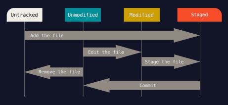

## git을 쓰는 이유
코드의 수정, 관리, 협업

## git 사용하기

입력은 터미널에서 한다. PowerShell, Git Bash 상관없다. (Git Bash는 리눅스 명령어를 사용할 수 있게 해준다)

#### 최초 설정: 컴퓨터에서 깃을 처음 사용한다면 입력
    git config --global user.name "깃허브 이름"
    git config --global user.email "깃허브 이메일"

#### 폴더 열고
    git init // 폴더를 git 저장소로 만든다. 이 폴더에서의 작업을 추적할 수 있게 된다.
#### 파일 열고
    git add 파일명 // 파일을 추적한다. staging area로 보낸다.
    git add . // 작업폴더의 모든 파일을 전부 스테이징한다.
#### 파일 작성 및 저장 후
    git commit -m "메세지" // 파일의 현재상태를 로컬 저장소에 기록한다. 현재 버전 생성.
커밋 메세지는 수정사항을 알아보기 쉽게 작성한다. ex) "docs: 자기소개 작성"
 + feat: 새로운 기능 추가
 + refactor: 기존 코드 개선
 + fix: 버그 수정
 + chore: 코드 외의 설정 변경
 + docs: 문서화
 + test: 테스트 코드
##### 파일 수정 후
다시 add, commit
#

## github 사용하기
#### remote repository 생성
깃허브에 repository를 생성한다. (repository의 이름을 깃허브 이름과 같게 만들면 README가 된다.)
#### local repository와 연결 (초기 설정)
    git remote add origin 주소
    git branch -M main
    git push -u origin main
#### github에 올리기
    git push origin main

## 명령어
    git status // 현재 상태를 알려준다. 변경된 파일, 스테이징된 파일 등
    git log // commit 기록을 보여준다. 종료는 q

<https://github.com/minseo6753/minseo6753>