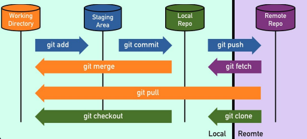

### git log
    git log //commit 기록을 최신순으로 확인
    git log --oneline //각 커밋을 한 줄에 요약

### Commit Id
- commit의 식별의 위해 사용하는 40자 길이의 16진수
- 중복 확률은 2의 80제곱 분의 1
- SHA-1 해시 함수를 사용

### HEAD
- 현재 작업중인 브랜치의 가장 최근 commit을 가리킴
- 즉, 다음 commit의 base가 되는 commit
- 새로운 commit이 생기면 변경됨

### git status
    git status
- 세 가지 상태에 따라 파일을 분류하여 확인한다
    + Changes to be commited
    + Changes not staged for commit
    + Untracked files

### commit --amend
- 마지막 commit의 내용에 변경이 있을 때 사용
- 완전히 새로운 commit으로 대체
- commit id가 바뀜
- vim으로 진입하여 commit 메세지를 수정하게 됨
```
git commit --amend -m "커밋 메세지" //vim 진입없이 commit 메세지 수정
git commit --amend --no-edit //commit 메세지 수정없이 commit 수정
```
- 주의: 다른 사람이 작업 기반으로 삼고 있는 commit은 amend하면 안된다.

### reset

- commit을 제거하는 데 사용
- 세 가지 옵션 존재
    + soft
        * 커밋만 취소
        * 변경 사항이 Staging Area로 돌아감
    + mixed(default)
        * 커밋을 취소
        * 변경 사항이 working directory로 돌아감
    + hard
        * 커밋을 취소
        * 변경 사항을 모두 제거하고 이전 커밋으로 돌아감
- 변경 사항이란 돌아갈 커밋 이후 커밋된 내용들을 말한다.
- 돌아갈 commit의 id를 사용
```
git reset --옵션 커밋아이디
```

### revert
    git revert 커밋아이디
- commit을 제거하지 않고 되돌림
- 되돌리기 위한 새로운 commit이 생성됨
- commit 내용에 반대되는 내용의 commit 생성
- --edit 옵션이 default
```
git revert --no-edit "commit id" //편집기 진입 없이 바로 revert 가능
git revert --no-commit //직접 commit 하지 않고, revert 내용을 Staging Area에 올림
```
### reset vs revert
- reset은 commit을 삭제하므로 위험
- commit을 공유하는 다른 브랜치에도 영향을 줄 수 있음
- commit을 삭제하기보다 생성하여 되돌리는 revert가 안전